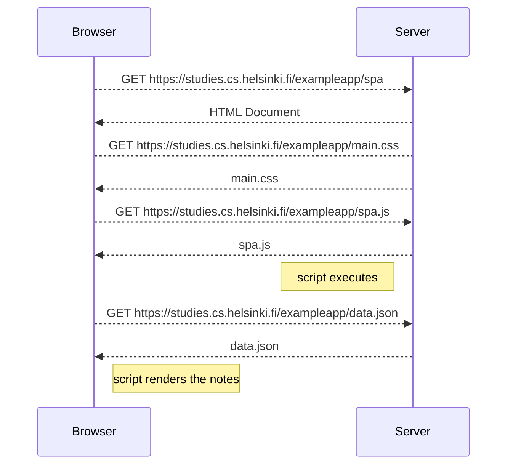

```mermaid
    sequenceDiagram
        Browser -->> Server: GET https://studies.cs.helsinki.fi/exampleapp/spa
        Server -->> Browser: HTML Document
        Browser --> Server: GET https://studies.cs.helsinki.fi/exampleapp/main.css
        Server -->> Browser: main.css
        Browser -->> Server: GET https://studies.cs.helsinki.fi/exampleapp/spa.js
        Server -->> Browser: spa.js
        Note left of Server: script executes
        Browser -->> Server: GET https://studies.cs.helsinki.fi/exampleapp/data.json
        Server -->> Browser: data.json
        Note right of Browser: script renders the notes

```
